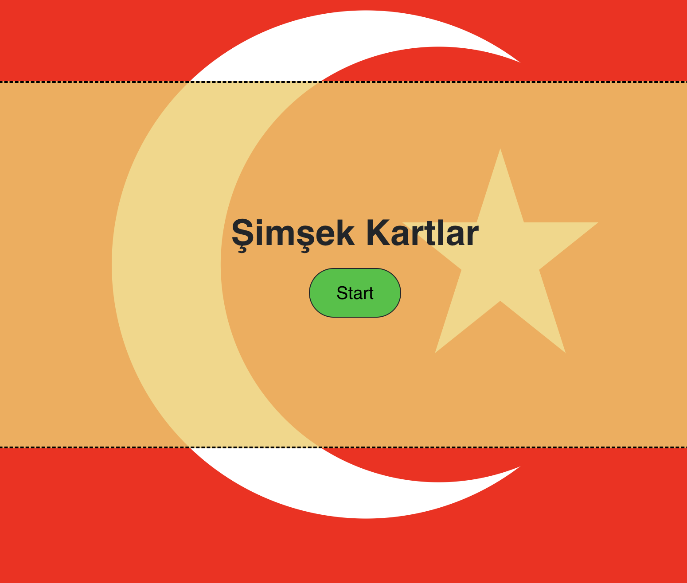

# Turkish-Study-Buddy 

## Table of Contents

- [Turkish-Study-Buddy ](#turkish-study-buddy-)
  - [Table of Contents](#table-of-contents)
  - [Description](#description)
  - [Installation](#installation)
  - [Usage](#usage)
  - [Testing](#testing)
  - [Contributors](#contributors)
  - [License](#license)
  - [Questions](#questions)

## Description
    
This is an application to help aid your study of the turkish language
    

## Installation
    
No installation necessary, it is deployed at https://turkish-study-buddy.vercel.app/

## Usage
    
Just log on and use the exercise tools for now, profiles and curriculum to come    

 

## Testing

The grammar functions have extensive testing suites, the repo can be cloned and npm run test, or for functional testing just click around

## Contributors
    
If you want something done right, you gotta do it yourself

## License
    
This is an application to help aid your study of the turkish language

## Questions

Philip Scott Neumann

https://github.com/moviefan322

philman202@yahoo.com
    